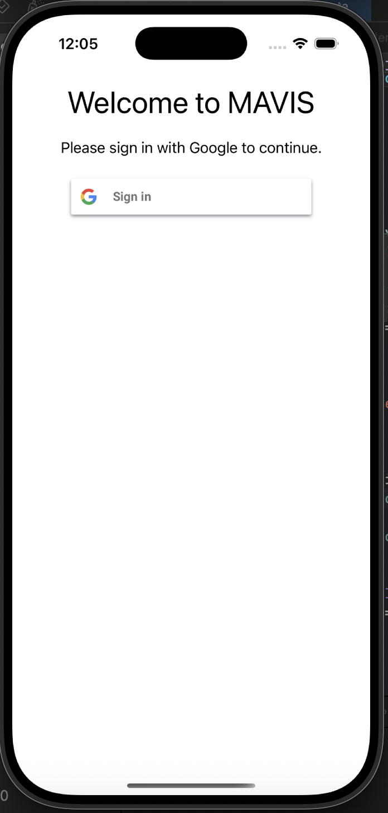
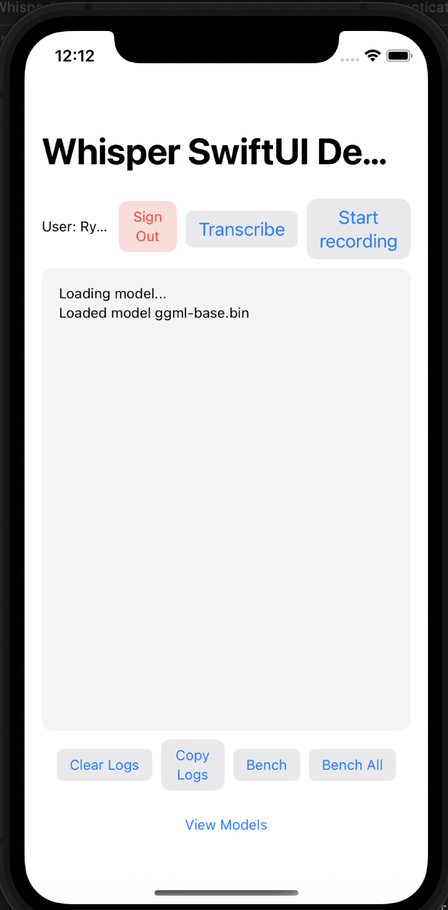
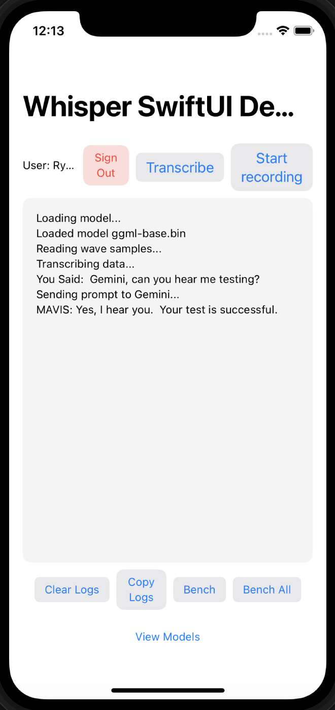
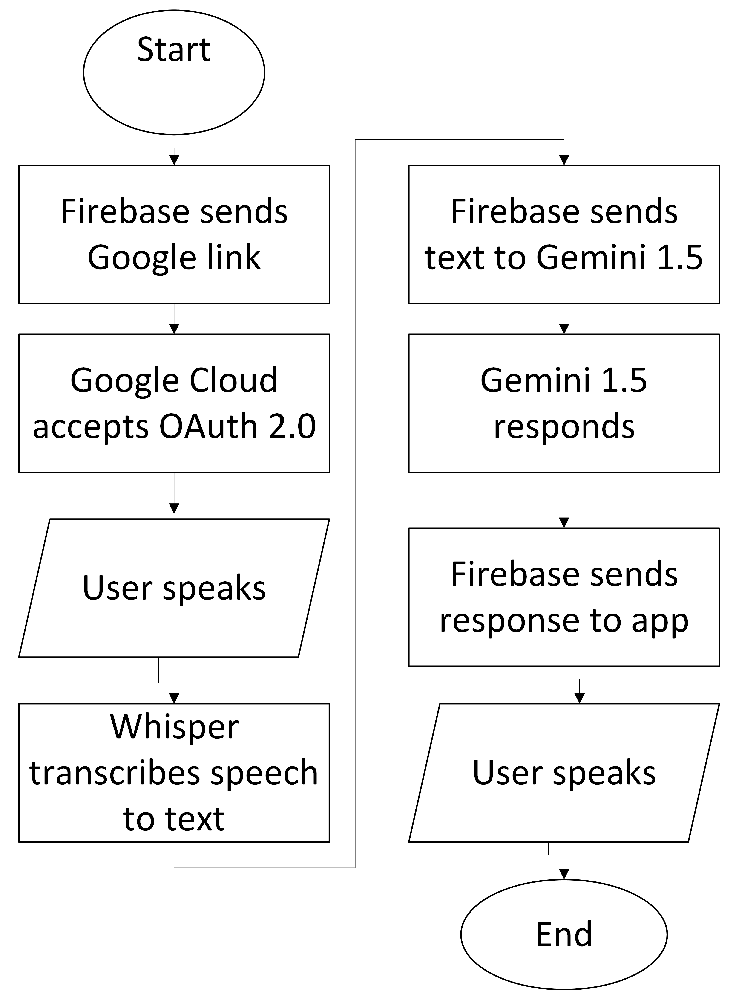
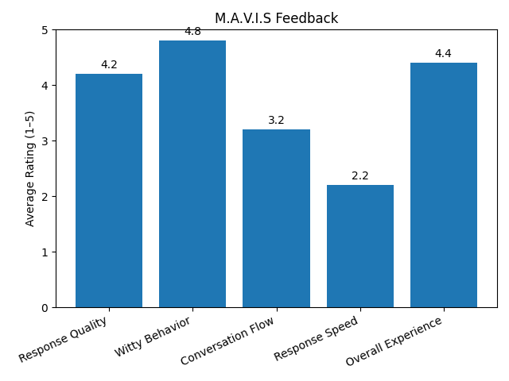

## Abstract
M.A.V.I.S (My Average Very Intelligent System) is a mobile-based AI voice assistant designed to deliver human-like, context-aware interactions through real-time speech processing. Developed using Swift in Xcode for iOS and powered by OpenAI’s Whisper and Google’s Gemini 1.5, M.A.V.I.S converts spoken input into natural, conversational responses. The app integrates Google OAuth 2.0 for user authentication, laying the groundwork for seamless access to productivity tools like Gmail and Google Calendar. Our architecture includes a flexible benchmarking framework for evaluating Whisper model performance and a Firebase-backed system that supports user authentication and backend services for transcription and language modeling. Ethical AI principles—including transparency, data privacy, and bias mitigation—are central to our design. User feedback is collected through structured post-use surveys to evaluate system performance and guide future development. M.A.V.I.S represents a step forward in personalized voice interfaces, combining technical sophistication with a focus on accessibility, user trust, and long-term adaptability.

## Introduction
Artificial Intelligence (AI) continues to evolve rapidly, transforming the way we engage with technology. M.A.V.I.S (My Average Very Intelligent System) is our AI-powered voice assistant designed to provide a fluid, interactive, and context-aware user experience. Inspired by the fictional J.A.R.V.I.S from the Iron Man universe, M.A.V.I.S pushes beyond the limitations of traditional assistants like Siri and Google Assistant by offering a more conversational, responsive, and personality-driven interaction style.

What sets M.A.V.I.S apart is its focus on contextual awareness, neural network integration, and real-time speech-to-text capabilities. Developed as an iOS mobile application using [Swift in Xcode](https://developer.apple.com/xcode/swiftui/), M.A.V.I.S now incorporates [OpenAI’s Whisper](https://github.com/openai/whisper) model for speech recognition and Google’s [Gemini 1.5](https://ai.google.dev/gemini-api/docs/models) for advanced language modeling. Unlike earlier prototypes relying on tools like [VOSK](https://alphacephei.com/vosk/) or [RASA](https://rasa.com/?utm_term=rasa&utm_campaign=brand&utm_source=adwords&utm_medium=ppc&hsa_acc=4543877749&hsa_cam=22295357674&hsa_grp=176151958696&hsa_ad=735249090449&hsa_src=g&hsa_tgt=kwd-139097884&hsa_kw=rasa&hsa_mt=p&hsa_net=adwords&hsa_ver=3&gad_source=1&gad_campaignid=22295357674&gbraid=0AAAAACqAaCuZ9qgyKmR10um4tXE05BnNc&gclid=Cj0KCQjw5ubABhDIARIsAHMighYR5A5G-7e-qBKEjEQ2zgj2xDF8cdh-90WOHX4LaE81WpvYr2oPBGAaAv1XEALw_wcB), the current version of M.A.V.I.S benefits from state-of-the-art LLM performance, enabling more natural and intelligent dialogue. The application also includes benchmarking features that allow users to compare Whisper model versions locally.

At present, M.A.V.I.S is a functioning app with a [Firebase](https://firebase.google.com/) backend supporting Google login via [OAuth 2.0](https://oauth.net/2/). It features a preloaded Whisper base model for speech-to-text conversion and connects to Gemini via backend API to process user prompts through a powerful LLM. The app includes a built-in benchmarking option and a modular structure to support future expansions. 

  
  

Looking ahead, future developers can build on this foundation by integrating external APIs such as Google Calendar, Gmail, and other productivity tools—an easier task thanks to the existing Google account login infrastructure already in place. With these future enhancements, M.A.V.I.S could grow into a fully personalized assistant capable of managing tasks, scheduling events, and streamlining digital life through intelligent automation.

## Related Works
When building M.A.V.I.S, we looked at a lot of other projects and research to understand what’s already out there and where we could do something different. One of the biggest areas we focused on was the ethics of advanced AI assistants. A paper by Gabriel et al. (2024) brings up important questions about trust, misuse, and value alignment—for example, they highlight how AI systems trained on biased datasets can unintentionally reinforce harmful stereotypes or prioritize corporate interests over user well-being[^1]. That stuck with us, and it’s why we’re putting a lot of emphasis on transparency, feedback loops, and diverse data from the start. We don’t want to just build something that works—we want it to be responsible and respectful of the people using it.

On the technical side, M.A.V.I.S now uses OpenAI’s Whisper for speech-to-text and connects to Google’s Gemini 1.5 through a backend API for advanced language understanding and response generation. This modernized setup replaces earlier tools like VOSK, RASA, and Mozilla TTS, offering greater accuracy, flexibility, and scalability. Our approach draws inspiration from projects like My Assistant SRSTC[^2], which used VOSK and RASA in an offline modular setup, and another assistant built on GPT-3.5 using the Web Speech API to handle browser-based interactions[^3]. These examples provided useful guidance for building a functioning speech pipeline.

Where we differentiate is in how we’ve prioritized personality and extensibility from the beginning. M.A.V.I.S isn’t just a tool that answers questions—it responds in a more natural, varied, and human-like way by leveraging the conversational power of large language models. While personality is hard to quantify, our focus has been on crafting interactions that feel casual, coherent, and context-aware. We’ve also implemented benchmarking options for Whisper models and established a solid foundation for future integrations, thanks to the OAuth 2.0 Google login system already in place. (A diagram of our updated pipeline, showing the flow from user input to Gemini output, is provided below.)

There’s also some cool research like LLaSM (Large Language and Speech Model) that aims to merge speech and text into a single training process[^4]. We’re not doing exactly that, but it definitely influenced how we think about context in speech—specifically, how understanding a user’s intent often depends on the flow of conversation, not just isolated commands. LLaSM’s approach to integrating multimodal input made us more aware of the importance of preserving context across turns in a dialogue, which informed our decision to use a powerful LLM like Gemini that can handle longer conversations with memory and nuance. While LLaSM is geared toward large-scale, instruction-following tasks, our focus is on real-time interaction and making the assistant feel alive—more like J.A.R.V.I.S than a basic Q&A bot.

We also took inspiration from projects that focus on specific user groups. One study looked at how older adults interact with voice assistants, and it pointed out how rule-based models don’t always understand different speech patterns, especially as people age[^3]. This made us think more about inclusivity and how we can make M.A.V.I.S flexible enough to work well for everyone—not just the tech-savvy.

Another interesting idea came from a paper about real-time emotion recognition in smart home assistants. They used things like MFCCs and CNNs to detect emotional tone in speech[^5]. We’re not fully there yet, but it got us thinking about how emotional awareness could be a future direction for M.A.V.I.S—making it not just smart, but empathetic and reactive in more human ways.

And finally, to help with some of the nuts and bolts of building this, we leaned on resources like Natural Language Processing: An Introduction[^4]. It’s more of a general guide, but it helped us troubleshoot and understand how to better structure our NLP models, especially when users go off-script or say something unexpected.

Overall, our approach to M.A.V.I.S blends what’s been done before with some fresh takes—like giving it a real personality, making it visually and auditorily engaging, and thinking through the ethical side from the beginning. It’s not just about building a tool, it’s about reimagining what interacting with AI could feel like.

## Methods
The current version of M.A.V.I.S is developed using Swift within Apple’s Xcode IDE for iOS deployment, with backend services built in Python and hosted via Firebase. Our primary focus has shifted toward delivering real-time, mobile-based user interactions powered by a robust neural network pipeline. The application utilizes OpenAI’s Whisper model for on-device speech-to-text conversion, enabling fast and accurate transcription of spoken input without requiring a cloud-based speech service. Users initiate voice interactions through a clean and intuitive iOS interface (see screenshots), which then triggers the transcription pipeline.

Once the audio is transcribed, the resulting text is packaged into a backend request and sent through a Firebase-connected function that communicates with Google’s Gemini 1.5 model. To ensure Gemini 1.5 responds with M.A.V.I.S's personality, we prepend each user prompt with the system-level instruction prompt "You are MAVIS(My Average Very Intelligent System). Your goal is to help user as an asistant. You have a witty british personality." This is put into every API call to Gemini, where natural language understanding is then performed and it generates a coherent, context-aware response. 

The response is then rendered in the mobile app as text, simulating a conversational exchange with the assistant.

User authentication is handled via Google OAuth 2.0, enabling secure login and laying the groundwork for future integrations with Google Calendar, Gmail, and other productivity tools. OAuth tokens are securely stored and session management is handled through Firebase’s built-in authentication and session infrastructure. For extensibility and benchmarking purposes, the app also includes functionality for users to test different Whisper model versions and compare performance across devices.

Audio files are stored with timestamps and saved locally for optional analysis, debugging, or future personalization. Throughout the system, we maintain a strong emphasis on data privacy, transparency, and ethical AI usage. Key challenges include managing varying audio input quality, ensuring fast API response times, and preserving user trust by securing sensitive data end-to-end.

The full pipeline is outlined in this flowchart:

## Ethical Sweep

**General Questions:** 

**Should we even be doing this?** 
Yes—if built responsibly, M.A.V.I.S has the potential to improve user interaction, accessibility, and productivity. However, this requires careful oversight, such as human-in-the-loop review mechanisms, ethical design audits, transparency in decision-making, and clearly defined boundaries for system capabilities to prevent misuse or overreliance. 

**What might be the accuracy of a simple non-ML alternative?**  
A non-ML alternative (e.g., rule-based systems) generally lacks the flexibility to interpret varied, natural speech and adapt to complex user inputs. Studies such as Jurafsky & Martin’s Speech and Language Processing [^15] show that modern ML-based NLP systems outperform traditional systems in accuracy and contextual comprehension across multiple tasks.

**How diverse is our team?** 
Our team includes members from various technical and creative backgrounds. 

**How will we maintain transparency for the model?**
We will document model decisions, communicate its limitations, and provide explanations for its generated responses when possible.

**Data Questions:**

**Is our data valid for its intended use?** 
The data will require ongoing validation and updates to maintain its relevance and accuracy.

**What bias could be in our data?**
The data may contain language, cultural, or demographic biases favoring certain perspectives over others which we must identify and address.

**How could we minimize bias in our data and model?** 
We can minimize bias by sourcing diverse and balanced datasets and applying bias detection techniques during training. This requires implementing comprehensive sampling strategies across different demographics, languages, and cultural contexts. Regular testing against known bias benchmarks and establishing feedback loops from diverse user groups will help identify and mitigate biases as they emerge. Additionally, maintaining transparent documentation about known limitations and potential bias areas will allow for ongoing improvement of the system.

**How should we "audit" our code and data?** 
We can implement automated testing, clear documentation, and human auditing of the system.

**How can we ensure data security?** If M.A.V.I.S was to be released at large scale, encryption for stored and transmitted data will be of utmost importance to ensure user privacy. We will also limit data retention and anonymize sensitive information.

## Results
To evaluate M.A.V.I.S, we collected user feedback through a structured post-interaction survey we sent out to our initial product testers (our friends). This survey is designed to follow principles from the System Usability Scale (SUS) and Likert-style evaluation, allowing for both quantitative analysis and actionable insight [^16]. 

Participants interacted with M.A.V.I.S for 5 minutes, and were then asked to rate the following on a scale of 1 (very poor) to 5 (excellent):

How would you rate the quality, accuracy, and relevancy of M.A.V.I.S’s responses?

How would you rate M.A.V.I.S’s witty behavior?

How natural did the conversation feel during your interaction with M.A.V.I.S?

How quickly did M.A.V.I.S respond to your voice?

What would you rate your overall experience with M.A.V.I.S?

The results are shown in this figure:

Responses were aggregated and analyzed to identify patterns in performance and user satisfaction. We then improved M.A.V.I.S based on this data, prioritizing features and improvements that align with user needs and expectations. For example, the relatively low rating for conversation flow (3.2) allowed us to prompt Gemini to be more concise and natural. The feedback mainly showed us we needed faster response times and a "personality" that distinguished it from something like Gemini or ChatGPT.

For more robust evaluation in the future, we will integrate the survey directly into the app. We also may adopt standard usability benchmarks or compare user sentiment before and after major updates.

## Discussion and Reflection
M.A.V.I.S was evaluated through a structured post-use survey where it was tested on speed, conversation quality, personality accuracy, and overall experience. Users rated its witty personality highly (4.8/5) and gave strong marks for overall experience (4.4/5), which tells us that the assistant’s tone and character set it apart from traditional voice interfaces. However, response speed scored lowest (2.2/5), pointing to a need for backend optimization.

Conversational accuracy also scored well (4.2/5), confirming that Gemini 1.5 did a good job with giving quality and relevant responses, especially when guided by our system prompt to maintain the M.A.V.I.S persona. Feedback supported our goal of making the assistant feel more human-like in casual exchanges.

Compared to Siri or Google Assistant, M.A.V.I.S offers more transparency and customization, since we control system prompts and behavior. However, the trade-off is speed since our open-source pipeline isn’t as fast as optimized proprietary systems.

Whisper also performed well for on-device speech recognition, with minimal errors in typical usage. This supports our choice to prioritize local processing for privacy and efficiency.

The results support our design decisions while highlighting areas to improve.

## Conclusion and Future Work
This project explored the integration of speech recognition, large language models, and voice assistant architecture into a unified mobile application. Through M.A.V.I.S, we demonstrated the viability of building a lightweight, extensible, and responsive AI system that goes beyond rigid command-response interactions to offer something more conversational, adaptive, and engaging. By combining OpenAI’s Whisper for speech-to-text, Google’s Gemini 1.5 for natural language understanding, and a Firebase-backed authentication system, we successfully delivered a working iOS prototype that balances technical complexity with user-friendly design.

Alongside the technical implementation, we took ethical considerations seriously—evaluating the potential for bias, privacy risks, and value misalignment. We also created a user feedback loop to assess interaction quality, model personality, and system usefulness, laying the groundwork for data-driven iteration. With more time, we would love to embed this short user survey into the application.

Speaking of looking ahead, future development will focus on expanding the assistant's capabilities through API integrations with tools like Google Calendar, Gmail, and other third-party services—made more accessible through the existing OAuth infrastructure. We also aim to refine conversational nuance, with a particular focus on emotional intelligence, tone adaptation, and response variability across diverse speech patterns and dialects.

Additionally, enhancing the app’s accessibility and inclusivity remains a top priority. This includes optimizing performance for low-end devices, ensuring support for multiple languages, and refining the UI for users with different needs or impairments. Long-term, our vision is to evolve M.A.V.I.S into a deeply humanized assistant—one that doesn’t just respond, but truly relates.

## References

[^1]: The Ethics of Advanced AI Assistants. https://arxiv.org/abs/2404.16244 ↩

[^2]: LLASM: Large Language and Speech Model. https://arxiv.org/pdf/2308.15930 ↩

[^3]: Understanding Older People’s Voice Interactions with Smart Voice Assistants: A New Modified Rule-Based Natural Language Processing Model with Human Input. https://pmc.ncbi.nlm.nih.gov/articles/PMC11135128/ ↩

[^4]: Natural Language Processing: An Introduction. https://www.researchgate.net/publication/51576224_Natural_language_processing_An_introduction ↩

[^5]: Real-Time Speech Emotion Analysis for Smart Home Assistants. https://ieeexplore.ieee.org/abstract/document/9352018 ↩

[^6]: My Assistant SRSTC: Speech Recognition and Speech to Text Conversion. https://ieeexplore.ieee.org/abstract/document/10593324 ↩

[^7]: Artificial Intelligence-Based Chatbot with Voice Assistance. https://ieeexplore.ieee.org/abstract/document/10545197 ↩

[^8]: VOSK Speech Recognition. https://alphacephei.com/vosk/ ↩

[^9]: RASA Documentation. https://rasa.com/docs/rasa/ ↩

[^10]: Mozilla Common Voice. https://commonvoice.mozilla.org/en ↩

[^11]: AudioViz by larryleeyu. https://github.com/larryleeyu/AudioViz ↩

[^12]: LJ Speech Dataset. https://keithito.com/LJ-Speech-Dataset/ ↩

[^13]: RASA Formbot Example Data. https://github.com/RasaHQ/rasa/blob/main/examples/formbot/data/nlu.yml ↩

[^14]: MultiWOZ Dataset. https://github.com/budzianowski/multiwoz ↩

[^15]: Jurafsky & Martin’s Speech and Language Processing. https://web.stanford.edu/~jurafsky/slp3/

[^16]: SUS and Likert-Style Evaluation. https://www.interaction-design.org/literature/article/system-usability-scale?srsltid=AfmBOooQgGpWxFwAN1UCGiLy8SBjtbQUMom10GkAUezJYCSLiFzJM0AY

[^17]: whisper.cpp. https://github.com/ggml-org/whisper.cpp